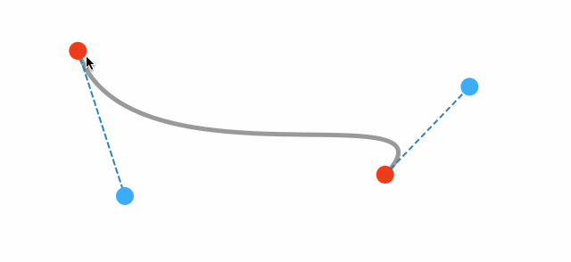

BezierCurveEditor
===

A quick and easy `UIBezierPath` path editor view.

Demo
---



Install
---

Add this repo to your swift package manager. 

```
https://github.com/cemolcay/BezierCurveEditor.gif
```

Usage
---

Create a `BezierCurveView` instance with a `BezierCurveData`. 

``` swift
let curveView = BezierCurveView(curve: .init())
view.addSubview(curveView)
```

`BezierCurveData` points are normalised between 0 - 1.  
0 is the begining of the `BezierCurveView`'s frame,  
1 is the end of the `BezierCurveView`'s frame. 